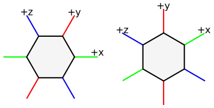

18xx map and tile generator
===========================

Will build 18xx assets in a deterministic way. Currently focussed on tile
manifests, printable tile sheets and maps. The program takes a bunch of JSON
files which dictate what it should do. It outputs to SVG files, scaled to fit
A4 paper.

## Hexagon space
Items within a hex are usually given in hexagon-space. This is a 3 dimensional
space where the axis are at 60° to each other. An example of the axes is given
below. Note that the orientation of the axis when the hexagons are oriented
with horizontal edges differs from when the hexagons are oriented with vertical
edges.

Instead of using coordinates in hexagon-space there are these position codes
that can be used as a shortcut. North is the upper edge on a hexagon that has
horizontal edges, it is the top left edge on hexagons that are oriented
vertically.

* `N`:  north edge
* `NE`: north east edge
* `NW`: north west edge
* `S`:  south edge
* `SE`: south east edge
* `SW`: south west edge
* `C`:  center of hexagon



When specifying coordinates a position code can be used by inserting one of
the six codes above as a string (`"N"`, `"NE"`, etc.) in the appropriate
location. As an alternative you can specify hexagon-space coordinates by using
`[<x>, <y>, <z>]` where `<x>`, `<y>` and `<z>` are floating point numbers.
These two methods of specifying coordinates are freely interchangeable.

## Colors
Here is a list of the colors that can be used, any other color string will be
black.

* `ground`
* `yellow`
* `green`
* `russet`
* `grey`
* `brown`
* `red`
* `blue`
* `barrier`
* `white`

## Modes
The program can operate in several different modes, they are described here.

### Definitions
By default the program runs in 'definitions' mode, meaning that it will output
all currently known tile definitions to a single file `definitions.svg`. The
output contains a list of tiles without a colour that can be used to define
other tiles in a game.

### Asset mode
Generates a tile manifest (lists each tile in the game and how many there are
in total) and sheets with tiles to print and play and play a specific game of
18xx. It will also generate a map on which the tiles can be placed.

### New game mode
Creates a new game that can be used for PBEM. A game allows you to place tiles
and tokens on a map without modifying the original map.

### State mode
Generates files to display the current state of a game started by the New game
mode. It will create a map and manifest that reflect the tiles and tokens that
have been placed. The manifest lists how many tiles are still available to be
placed.

# Command line arguments
A list of command line options is given below:

* `-h` and `--help`: display usage and help. When you specify a mode followed
  by `-h` then help is given for that mode.
* `-V` and `--version`: display version information and exit
* `-v` and `--verbose`: output debug information.
* `-c` and `--debug-coordinates`: put coordinates at each row/column instead
  of every other column/row.

# Tile definitions
To build a game you first need to know what tiles are available. To simplify
the specification of tiles there are tile definitions which cover possible
configurations of tiles. These definitions include the tracks and stations on
a tile, but they also dictate where revenue circles and other text on the tile
goes. The tile definitions live in `tiledefs/`, there is one tile definiton per
file. The filename (the part before the .json) determines how the tile can be
refered to from other files. The contents of the file can include:

* An array called `paths`, defining the lines on the tile.
* An array called `cities`, defining the tokenable places on the tile.
* An array called `stops`, defining the non-tokenable revenue locations on the
  tile.
* An array called `text`, defining additional text that can occur on the tile.
* A `is_lawson` parameter that makes the centre of a tile prettier.

The `is_lawson` parameter is a boolean that is `false` by default. It will draw
the centre of a tile neatly when multiple lines meet there. The tile number is
always drawn at the bottom right corner and has `text_id = 0`.

## Text IDs
Before discussing what can be defined on a tile it is necessary to know how to
specify text. For simplicity sake a tile definition specifies where text on the
tile is supposed to go. Each such a location can be given a name, the name
`number` is reserved for the tile number that appears in one of the corners.
A tile manifest or map can then specify what text goes on the tile by using a
map `{"<id>": "text"}`. It is valid to not specify a text for some IDs, these
will not be added.

## `text` array
Free text on a tile can be specified by the `text array`. Each entry defines a
single place to write text to. The usually look like
```JSON
{
	"id": "code",
	"position": [0.5, 0.0, 0.0],
	"anchor": "Start",
	"size": "120%",
	"weight": 900,
}
```

The `id`, `position`, and `anchor` fields are required. The `size` and `weight`
fields can be ommitted, they define the size of the letters and their boldness
respectively. The default `size` is 80% while the default weight is determined
by the SVG renderer. The `id` field is the text ID as described above. The
`position` can be a hex-space coordinate or a coordinate code as specified in
the 'Hexagon space' section above. The `anchor` field can be any of `Start`,
`Middle`, and `End`. It determines how the text is aligned to the `position`
that was specified. Because just having a list of text can be confusing it is
possible to add a `purpose` field. This field is ignored but is useful for
human readers.

## `paths` array
To define the lines that run across a tile you can use the `paths` array. Each
entry defines a single path. They usually look like
```JSON
{
	"start": "N",
	"end": [0.1, 0.2, 0.3],
	"is_bridge": true
}
```

There are several things here. First are the `start` and `end` keys, these
define the start and end positions of a path respectively. These can take the
position codes and hexagon-space coordinates that were defined in the
'Hexagon space' section.

Usually paths are drawn with level crossings. If paths cross but it is not
allowed to switch there the `is_bridge` key can be used. Its default value is
`false`. When set to `true` it will cause white lines to be drawn along the
path it is specified on whenever it intersects with another path. It is only
necessary to specify it on one of the crossing paths.

## `cities` array
Cities which have a space for tokens can be defined using the `cities` array.
Each city defines a new set of up to 4 token circles with its own revenue
circle. It is currently not possible to rotate a city. A city can be defined as
```JSON
{
	"circles": 2,
	"position": "C",
	"text_id": 1,
	"revenue_position": [0.0, 0.6, 0.0]
}
```

The first key is the `circles` key, this determines how many token spots are
available. This can be any number between 1 and 4 inclusive, if another
amount is specified then a red circle will be drawn to indicate that it is an
invalid amount. The `position` key specifies where to put the city. Usually it
doesn't make sense to use a position code other than `C` because the city would
be drawn half off the tile.

To define where the revenue should be located the `revenue_position` key can be
used. It is recommended to use a hexagon-space coordinate. Along with
`revenue_position` there is a `text_id` which specifies which string ends up as
the revenue number. It is suggested to set this to 1 for consistency. If
different cities earn different revenue they should have a different `text_id`.

## `stops` array
Small cities are always rendered as small black circles. In the future it may
become possible to render them as dashes as well. A stop is defined as
```JSON
{
	"position": [0.0, 0.0, 0.0],
	"text_id": 1,
	"revenue_angle": 30
}
```

A stop must have these three fields, other fields are ignored. The `position`
key defines where a stop is positioned. The `text_id` field specifies which
string is used as the revenue. The revenue circle is always at the same
distance from a stop. You can specify where it goes with the `revenue_angle`
key. This is the angle in degrees at which the revenue circle should be drawn
relative to the stop.

# Game asset mode
By using `assets` for the mode option mode you can put the program into game
mode that will generate all files to PnP a game. The asset mode requires an
additional `NAME` parameter; this is the name of the game to generate files
for. The available games are the sub directories in the `games` directory. This
outputs a tile manifest in `manifest.svg` and a list of files called
`NAME-sheet-x.svg` where NAME is the name of the game and x is a sequence
number.  The manifest file contains an example of each tile in the game
together with a number that indicates how many of those tiles are available
during play. The numbered sheets can be printed directly on A4 paper to create
all the tiles required to play the game. There is also a file which specifies
companies, their color, and their home station.

## Tile manifest
The tile manifest of a game is specified in games/GAME/manifest.json. The tile
manifest consists of a list of tiles and a list of how often this tile can be
used in the game. The definition of a usable tiles is given by the `tiles`
array. A single entry looks like
```JSON
{
	"color": "green",
	"base_tile": "52",
	"text": {
		"number": "59",
		"revenue": "40",
		"code": "OO"
	}
}
```

There are several elements here. The first is the `color` key, this defines
which color the tile is. Usual picks are yellow, green, russet and grey. The
next key is `base_tile` which specifies which tile definition is used. This
can be any JSON file in the `tiledefs/` directory. Finally is the `text`
array, it specifies the string that the text IDs in the tile definition refer
to. The first entry is always the displayed tile number, this does not have to
be the same as the `base_tile` key. The meaning of other entries depends on
what the tile definition used as `text_id`.

To specify the amounts available of each tile there is an `amounts` map, it
looks like
```JSON
"amounts": {
	"1": 1,
	"2": 1,
	"3": 2,
	"4": 2,
	"7": 4
}
```

It has a number of string keys, these are the tile number that were defined
the `"number"` pair in the tile's `text` map.  After the colon is the amount of
tiles that are available for placement during the game.

## Game map
The map of the game is defined in games/GAME/map.json. It specifies several
fields
```JSON
{
	"orientation": "Horizontal",
	"scale": 3.81,
	"width": 12,
	"height": 11,
	"barriers": [ ... ],
	"tiles": [ ... ]
}
```

The only field that is not required to be specified is the `barriers` array.
The `orientation` field can either be set to `Horizontal` or to `Vertical`,
this determines whether the hexagons have a flat edge or a corner on top. The
`scale` field determines the size of the hexagons in centimeters. This is
measured from one flat side to its opposing side. Most 18xx use a value of
3.81. The `width` and `height` fields determine how many hexagons there are to
each row and column respectively. The `barriers` array specifies impassible
hex-sides. Each entry in the array looks like
```JSON
{
	"location": [8, 2],
	"side": "N"
}
```
The `location` specifies the tile on which the barrier should appear, it
consists of a `x` and a `y` coordinate. [0, 0] is the top left tile. The `side`
field determines on which edge the barrier should appear. Only names can be
used here, it is not allowed to use hex-space coordinates. Because each edge is
shared between two tiles the barrier can be specified to be on either of them.

Finally there is the `tiles` array, its entries look like
```JSON
{
	"location": [4, 0],
	"color": "red",
	"tile": "8,
	"orientation": "S",
	"text": [ ... ],
	"revenue": { ... },
	"arrows": [ ... ]
}
```
Of all these fields only the `location` is required, it defines the x and y
coordinate of tile being specified. The coordinate [0, 0] is the top left tile.
The `color` field specifies the color of the tile, it can be any of the colors
that are available (see 'Colors'). The default color is `ground`. The `tile`
field changes which tile definition is used. This should be a number as in the
`tiledefs/` directory, not as specified in the game's manifest. The default
tile is the `plain` tile. The `text` array defines the text to use for each
text entry in the tile definition. The field which specifies the tile number is
ignored so the first element in this array is the string to be used for text ID
1. The `orientation` field rotates the tile as necessary. It can be any of the
tile edge codes, but not a hex-space coordinate. The rotation indicates which
edge of the tile should be placed at the north edge. The `revenue` object
specifies an optional revenue track, more details on this later. The `arrows`
array specifies where track continuation arrows, as those found on off-boards,
should be placed. Each of its elements can be a coordinate but it makes little
sense to place them anywhere other than the edge.

A `revenue` object looks like
```JSON
{
	"position": "C",
	"yellow": "20",
	"green": "30",
	"russet": "40",
	"grey": "50"
}
```
Of these fields only the `position` and `yellow` are required. The `position`
field specifies the coordinate that is the centre of the revenue track. The
other fields all define the value that should be in the field of that color.

## companies
The companies are specified in games/GAME/companies.json. This file consists of
a map of companies. A typical entry looks like
```JSON
"B&O" : {
	"name": "Baltimore & Ohio Railroad",
	"color": "blue",
	"home": [7, 8]
},
```
The key (`B&O` here) is used to refer to this company from any other files. It
is also the text that will be printed on the token. The `name` field is
currently not used but it is required. The `color` field indicates what the
color of the token and home reservation should be. The `home` field specifies
the home hex and optionally the home city on that hex. When a tile has multiple
cities on it then you can use this to move the home station between them. When
you do you can add the city number to the array so that it becomes `"home": [7,
8, 1]`. When you don't specify this city number it defaults to 0.

# New game mode
To use new game mode you have to use the command `map18xx newgame <game>
<name>`. This will generate a file called `<name>.json` in the current
directory which can be used to play `<game>`

# State mode
To show the current state of a game that you're playing you can use the state
mode. To use it run the command `map18xx state <name>` where `<name>` is the
name of the game you used in new game mode. It will look for a file
`<name>.json` in the current directory. It also accepts the
`--debug-coordinates` command line parameter

To be able to play the game you have to alter the `log` array that is in your
`<name>.json` file. In this array you can place two types of action: tile lays
and token placements. To do one of these actions simply append them to the end
of the array. Later actions take precedence over earlier actions, map18xx does
not enforce upgrade paths. Placing a tile looks like
```JSON
{
	"type": "tilelay",
	"location": [9, 6],
	"tile": "62",
	"orientation": "NE"
}
```
The `type` field must be `tilelay` to place a tile. The `location` field
specifies the tile on which the tile will be laid. At the moment this must be a
coordinate that is given when you use `--debug-coordinates`. The `tile` field
is the number of a tile as given in the manifest. `orientation` can be used to
rotate the tile, the orientation of the tile shown in the manifest is `N`.

To place a token the log entry looks like
```JSON
{
	"type": "token",
	"location": [9, 6],
	"company": "B&O",
	"city": 1
}
```
The `type` field must be `token` to place a token. The `location` field is the
same as for placing a tile. The `company` field is the abbrevation of the
company. The `city` field is optional, the default is 0. You can use it to
specify in which city the token must be placed when a tile has multiple cities
(OO or NY in 1830 for example). For tiles with a single city it is not
necessary. When you don't specify it while a city has multiple stations the
token will be placed in city 0.
